# Software Design Document: Tuition Management System

**Version:** 2.0
**Date:** 2026-05-27
**Status:** Draft
**Author:** Enterprise Application Architect

---

## Table of Contents

1. [Executive Summary](#1-executive-summary)
2. [Business Requirements Specification](#2-business-requirements-specification)
3. [Architecture Overview](#3-architecture-overview)
4. [Component Architecture](#4-component-architecture)
5. [Data Architecture](#5-data-architecture)
6. [Matching Algorithm Design](#6-matching-algorithm-design)
7. [Security Architecture](#7-security-architecture)
8. [PDPA Compliance Design](#8-pdpa-compliance-design)
9. [Infrastructure Architecture](#9-infrastructure-architecture)
10. [Technology Stack Recommendations](#10-technology-stack-recommendations)
11. [Apps Script Module Design](#11-apps-script-module-design)
12. [Phased Development Roadmap](#12-phased-development-roadmap)
13. [AWS Well-Architected Framework Analysis](#13-aws-well-architected-framework-analysis)
14. [Trade-off Analysis](#14-trade-off-analysis)
15. [Hosting Recommendations](#15-hosting-recommendations)
16. [Risk Register](#16-risk-register)
17. [Appendices](#17-appendices)

---

## 1. Executive Summary

### 1.1 Business Context

A Singapore-based nonprofit peer tutoring organization currently manages its tutoring operations using Google Forms (student intake), Google Sheets (tutor database), and manual matching by admin staff. This manual process creates significant administrative overhead and makes it difficult to find the optimal tutor for each student's specific needs.

### 1.2 Project Goals

1. **Primary**: Eliminate administrative overhead by automating tutor-tutee matching, scheduling, and record-keeping
2. **Secondary**: Improve match quality by implementing algorithmic matching based on defined criteria
3. **Tertiary**: Provide transparent tracking of VIA (Values in Action) hours for peer tutors

### 1.3 Key Decisions

| Decision | Choice | Rationale |
|---|---|---|
| Business model | Institutional tool (nonprofit) | Internal use by a single tutoring organization |
| Target users | Secondary school students (ages 12-18) in Singapore | All users are minors -- PDPA protections for minors apply |
| Tutoring model | Peer tutoring (older students tutor younger ones) | Tutors earn VIA hours, not monetary compensation |
| Lesson delivery | 100% online via Google Meet | Auto-generated meeting links |
| Matching approach | Semi-automated (system suggests, admin approves) | Evolving toward full automation |
| Technology platform | Google Apps Script + Google Workspace | Zero cost, familiar ecosystem, no infrastructure to manage |
| Database | Google Sheets | Already in use, zero cost, admin-editable, no database server needed |
| Authentication | Google account (Workspace/Gmail) | Native to the platform, no additional auth system needed |
| Hosting | Google Apps Script Web App | Free, auto-hosted by Google, HTTPS by default |
| Maintenance model | Low-maintenance, self-running | No dedicated technical staff |
| White-labeling | Configurable branding and terminology | Deployable for multiple organizations without code changes |

### 1.4 Constraints

- **Budget**: Zero (Google Workspace free tier / Google account only)
- **Technical staff**: None -- system must be self-running with minimal maintenance
- **Users**: All minors -- strict PDPA compliance required
- **Scale**: 100 users at launch, 10% annual growth (modest)
- **Platform**: Google Apps Script execution limits (6 min/execution, 90 min/day for free accounts)

### 1.5 Architecture Change Rationale (v2.0)

The architecture has been revised from a traditional web application (Next.js + Supabase + Cloud Run) to a **Google Apps Script + Google Workspace** solution for the following reasons:

1. **Zero infrastructure cost** -- no cloud compute, no database server, no hosting fees
2. **Zero maintenance burden** -- Google manages all infrastructure, no patching, no server management
3. **Familiar tools** -- the organization already uses Google Forms and Google Sheets
4. **No technical staff required** -- admin can inspect and edit data directly in Google Sheets
5. **Built-in integrations** -- native access to Gmail, Google Meet, Google Drive, Google Calendar
6. **Gradual migration** -- builds on existing workflows rather than replacing them entirely

### 1.6 White-Label Design

The Tuition Management System is designed as a **white-label application** that can be branded and deployed for multiple organizations without code changes. All organization-specific elements are stored in the Configuration sheet:

| Configurable Element | Config Key | Example Value |
|---|---|---|
| Application name | `app_name` | "ABC Tuition Hub" |
| Organization name | `org_name` | "ABC Learning Center" |
| Logo URL | `logo_url` | Google Drive image URL |
| Primary color | `primary_color` | "#1976D2" |
| Secondary color | `secondary_color` | "#FF9800" |
| Email sender name | `email_sender_name` | "ABC Tuition Hub" |
| Email footer text | `email_footer` | "ABC Learning Center, Singapore" |
| Tutor label | `label_tutor` | "Tutor" (or "Mentor", "Coach", etc.) |
| Tutee label | `label_tutee` | "Tutee" (or "Student", "Learner", etc.) |
| Session label | `label_session` | "Session" (or "Lesson", "Class", etc.) |

**Deployment for a new organization** requires only:
1. Copy the master Google Spreadsheet (includes all sheets and Apps Script code)
2. Update branding values in the Configuration sheet
3. Deploy a new Apps Script Web App from the copied project
4. Share the Web App URL with users

No code modifications are needed for rebranding. The HTML templates and email templates read all labels and styling from the Configuration sheet at runtime.

---

## 2. Business Requirements Specification

### 2.1 Functional Requirements

#### FR-001: User Management

| ID | Requirement | Priority | Implementation |
|---|---|---|---|
| FR-001.1 | Admin can create, edit, and deactivate Tutor and Tutee accounts | Must Have | Admin UI in Apps Script Web App + direct Sheets editing |
| FR-001.2 | Admin can bulk import users from CSV files | Must Have | Google Sheets import (native) or Google Form bulk submission |
| FR-001.3 | Users authenticate via Google account | Must Have | Apps Script Session.getActiveUser() for Web App |
| FR-001.4 | System supports three roles: Admin, Tutor, Tutee | Must Have | Role column in Users sheet, checked via Apps Script |
| FR-001.5 | A user can hold both Tutor and Tutee roles simultaneously | Must Have | Multiple role values per user row |
| FR-001.6 | User profiles store: name, email, phone, school, class level, academic performance/grades | Must Have | Columns in Users Google Sheet |
| FR-001.7 | Admin can view and manage all user profiles | Must Have | Admin dashboard in Web App |

#### FR-002: Matching System

| ID | Requirement | Priority | Implementation |
|---|---|---|---|
| FR-002.1 | System automatically suggests tutor-tutee matches based on defined criteria | Must Have | Apps Script matching function reads from Sheets |
| FR-002.2 | Primary matching criteria (in priority order): subject, class level, MOE difficulty level, lesson frequency, lesson type | Must Have | Weighted scoring algorithm in Apps Script |
| FR-002.3 | Secondary matching criteria: schedule overlap, tutor past performance/ratings | Must Have | Additional scoring factors |
| FR-002.4 | Admin reviews and approves/rejects suggested matches | Must Have | Suggestions sheet + Admin Web App UI |
| FR-002.5 | Admin can manually override and create matches | Must Have | Direct edit in Matches sheet or via Web App |
| FR-002.6 | Admin can bulk assign matches | Must Have | Batch approval in Web App or Sheets |
| FR-002.7 | System tracks match history and outcomes | Should Have | Match History sheet with status tracking |

#### FR-003: Scheduling

| ID | Requirement | Priority | Implementation |
|---|---|---|---|
| FR-003.1 | Tutors set their available time slots in the system | Must Have | Google Form or Web App availability picker |
| FR-003.2 | Tutees indicate their preferred time slots | Must Have | Google Form or Web App preference picker |
| FR-003.3 | System identifies schedule overlaps between matched pairs/groups | Must Have | Apps Script overlap calculation |
| FR-003.4 | Admin has central control to manage and override schedules | Must Have | Sessions sheet + Admin Web App |
| FR-003.5 | Session duration is variable (specified per session) | Must Have | Duration column in Sessions sheet |
| FR-003.6 | No minimum lead time for scheduling (flexible) | Must Have | No validation constraint needed |
| FR-003.7 | System supports both regular (recurring) and ad hoc (one-time) sessions | Must Have | Recurrence column + Apps Script to generate recurring entries |

#### FR-004: Session Management

| ID | Requirement | Priority | Implementation |
|---|---|---|---|
| FR-004.1 | System auto-generates Google Meet links for each scheduled session | Must Have | Google Calendar API via Apps Script creates event with Meet link |
| FR-004.2 | Supports 1-to-1 sessions | Must Have | Single tutor + single tutee in session row |
| FR-004.3 | Supports group sessions with up to 50 students | Must Have | Session linked to multiple tutee rows via Session Participants sheet |
| FR-004.4 | Tutor submits session evidence (screenshot upload) after completion | Must Have | Google Form with file upload to Google Drive |
| FR-004.5 | Admin verifies and approves completed sessions | Must Have | Status column update in Sessions sheet via Web App |
| FR-004.6 | Session states: Scheduled, In Progress, Pending Verification, Verified, Cancelled | Must Have | Status column with data validation dropdown |

#### FR-005: VIA Hours Tracking

| ID | Requirement | Priority | Implementation |
|---|---|---|---|
| FR-005.1 | System automatically calculates VIA hours based on verified session durations | Must Have | Apps Script triggered on session verification |
| FR-005.2 | Admin can view VIA hours per tutor (cumulative and per period) | Must Have | VIA Hours sheet with SUMIFS or Apps Script dashboard |
| FR-005.3 | Admin can manually adjust VIA hours | Must Have | Adjustment rows in VIA Hours sheet |
| FR-005.4 | Tutors can view their own accumulated VIA hours | Must Have | Tutor dashboard in Web App |
| FR-005.5 | System sends notifications when VIA hour milestones are reached | Should Have | Apps Script trigger checks milestones after verification |

#### FR-006: Subject and Level Configuration

| ID | Requirement | Priority | Implementation |
|---|---|---|---|
| FR-006.1 | Admin can add, edit, and deactivate subjects | Must Have | Configuration sheet editable by admin |
| FR-006.2 | Admin can configure class levels | Must Have | Configuration sheet with class levels list |
| FR-006.3 | Admin can configure MOE difficulty levels per subject | Must Have | Configuration sheet with difficulty mappings |
| FR-006.4 | Configuration changes take effect immediately | Must Have | Apps Script reads config from Sheets in real-time |

#### FR-007: Notifications

| ID | Requirement | Priority | Implementation |
|---|---|---|---|
| FR-007.1 | Email notifications for session reminders (24 hours before) | Must Have | Time-driven Apps Script trigger + GmailApp |
| FR-007.2 | Email notifications for new match assignments | Must Have | Apps Script triggered on match approval |
| FR-007.3 | Email notifications for schedule changes and cancellations | Must Have | Apps Script triggered on session status change |
| FR-007.4 | Email notifications for VIA hour milestones | Should Have | Apps Script milestone check |

#### FR-008: Reporting and Dashboards

| ID | Requirement | Priority | Implementation |
|---|---|---|---|
| FR-008.1 | Admin dashboard showing active matches, session counts, tutor utilization | Must Have | Apps Script Web App dashboard page with Charts |
| FR-008.2 | VIA hours summary report per tutor | Must Have | Dedicated sheet view or Web App report |
| FR-008.3 | Session completion and verification status overview | Must Have | Dashboard metrics from Sessions sheet |
| FR-008.4 | Matching success rate metrics | Should Have | Calculated from Matches sheet data |

#### FR-009: Audit Trail

| ID | Requirement | Priority | Implementation |
|---|---|---|---|
| FR-009.1 | All user actions are logged with timestamp and user identity | Must Have | Audit Log sheet (append-only via Apps Script) |
| FR-009.2 | All admin actions are logged (user changes, match overrides, VIA adjustments) | Must Have | Apps Script logs every admin action |
| FR-009.3 | Audit logs are immutable and viewable by admin | Must Have | Protected sheet (no edit/delete, append-only via script) |
| FR-009.4 | Audit logs are retained for at least 1 year | Must Have | Retained in Sheets; archival to separate spreadsheet if needed |

### 2.2 Non-Functional Requirements

#### NFR-001: Performance

| ID | Requirement | Target | Google Apps Script Consideration |
|---|---|---|---|
| NFR-001.1 | Page load time | < 5 seconds | Apps Script Web Apps have initial load latency (~2-5s) |
| NFR-001.2 | Script execution time | < 30 seconds per operation | Well within 6-minute execution limit |
| NFR-001.3 | Matching algorithm execution | < 60 seconds for full suggestion generation | Feasible for 100-200 users |
| NFR-001.4 | Bulk import (100 records) | < 60 seconds | Google Sheets native import is instant |

#### NFR-002: Availability

| ID | Requirement | Target |
|---|---|---|
| NFR-002.1 | System availability | 24/7 (Google infrastructure SLA 99.9%) |
| NFR-002.2 | Planned maintenance | Handled by Google transparently |
| NFR-002.3 | Recovery Time Objective (RTO) | < 1 hour (Google Sheets version history) |
| NFR-002.4 | Recovery Point Objective (RPO) | Near-zero (Google auto-saves continuously) |

#### NFR-003: Security

| ID | Requirement | Target |
|---|---|---|
| NFR-003.1 | Authentication | Google account (managed by Google) |
| NFR-003.2 | Authorization | Role-Based Access Control via Apps Script + sheet-level permissions |
| NFR-003.3 | Data encryption in transit | TLS (managed by Google) |
| NFR-003.4 | Data encryption at rest | AES-256 (managed by Google) |
| NFR-003.5 | PDPA compliance | Mandatory (all users are minors) |

#### NFR-004: Scalability

| ID | Requirement | Target |
|---|---|---|
| NFR-004.1 | Initial user capacity | 100 users |
| NFR-004.2 | Growth capacity | Up to 500 users without re-architecture |
| NFR-004.3 | Google Sheets row limit | 10 million cells per spreadsheet (sufficient for years) |
| NFR-004.4 | Data growth | 5 years of session and audit data within Sheets limits |

#### NFR-005: Maintainability

| ID | Requirement | Target |
|---|---|---|
| NFR-005.1 | Technical staff required | None (self-running) |
| NFR-005.2 | Admin technical proficiency | Non-technical (familiar with Google Sheets/Forms) |
| NFR-005.3 | Deployment complexity | None -- Apps Script deploys from browser-based editor |
| NFR-005.4 | Update process | Edit script in Apps Script editor, deploy new version |
| NFR-005.5 | Data inspection | Admin can directly view/filter data in Google Sheets |

#### NFR-006: Data Retention

| ID | Requirement | Target |
|---|---|---|
| NFR-006.1 | Default retention period | 1 year after user deactivation |
| NFR-006.2 | Retention period configurability | Admin-configurable in Config sheet |
| NFR-006.3 | Data purging | Automated via scheduled Apps Script trigger |

### 2.3 User Personas

#### Persona 1: Admin (Organization Staff)

- **Technical proficiency**: Low to moderate (comfortable with Google Sheets and Forms)
- **Primary goals**: Manage users, approve matches, verify sessions, track VIA hours, generate reports
- **Pain points**: Currently spends hours on manual matching via spreadsheets
- **Key requirements**: Intuitive dashboard, bulk operations, clear status visibility, ability to fallback to direct Sheets editing
- **Advantage of this architecture**: Can always inspect and edit data directly in the familiar Google Sheets interface

#### Persona 2: Tutor (Peer Student, ages 15-18)

- **Technical proficiency**: High (digital native, comfortable with apps)
- **Primary goals**: View assigned tutees, set availability, submit session evidence, track VIA hours
- **Pain points**: Unclear on session expectations, wants to see accumulated VIA hours easily
- **Key requirements**: Mobile-friendly Web App, simple availability picker, easy evidence upload via Google Form, VIA hours display

#### Persona 3: Tutee (Student, ages 12-18)

- **Technical proficiency**: High (digital native)
- **Primary goals**: View assigned tutor, set preferred times, join sessions
- **Pain points**: Wants to know when next session is, easy access to Google Meet link
- **Key requirements**: Mobile-friendly Web App, clear session schedule, one-click Google Meet join

### 2.4 User Roles and Permissions

| Permission | Admin | Tutor | Tutee |
|---|---|---|---|
| View own profile | Yes | Yes | Yes |
| Edit own profile | Yes | Yes (via Form) | Yes (via Form) |
| View all user profiles | Yes | No | No |
| Create/edit/deactivate users | Yes | No | No |
| Bulk import users | Yes (Sheets import) | No | No |
| View match suggestions | Yes | No | No |
| Approve/reject matches | Yes | No | No |
| Override matches | Yes | No | No |
| View own matches | Yes | Yes | Yes |
| Set availability | No | Yes | Yes |
| View schedule | Yes (all) | Yes (own) | Yes (own) |
| Override schedule | Yes | No | No |
| Submit session evidence | No | Yes (via Form) | No |
| Verify sessions | Yes | No | No |
| View VIA hours | Yes (all) | Yes (own) | No |
| Adjust VIA hours | Yes | No | No |
| Configure subjects/levels | Yes (edit Config sheet) | No | No |
| View reports/dashboards | Yes | No | No |
| View audit trail | Yes | No | No |
| Access Google Sheets directly | Yes | No | No |

### 2.5 Integration Requirements

| Integration | Direction | Purpose | Method |
|---|---|---|---|
| Google Account Auth | Inbound | User authentication | Session.getActiveUser() in Apps Script |
| Google Calendar API | Outbound | Create events with Google Meet links | CalendarApp / Calendar Advanced Service |
| Google Meet | Outbound | Auto-generated meeting links via Calendar events | ConferenceData in Calendar API |
| Gmail | Outbound | Send email notifications | GmailApp.sendEmail() or MailApp.sendEmail() |
| Google Drive | Storage | Store session evidence screenshots | DriveApp for file management |
| Google Forms | Inbound | Student onboarding, availability, evidence submission | Form responses linked to Sheets |
| Google Sheets | Database | All data storage | SpreadsheetApp for CRUD operations |

### 2.6 Key User Workflows

#### Workflow 1: New Student Onboarding

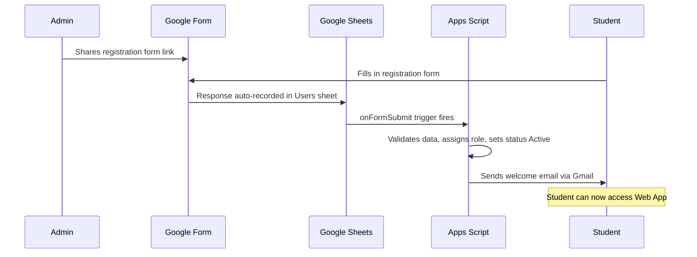

#### Workflow 2: Matching Process

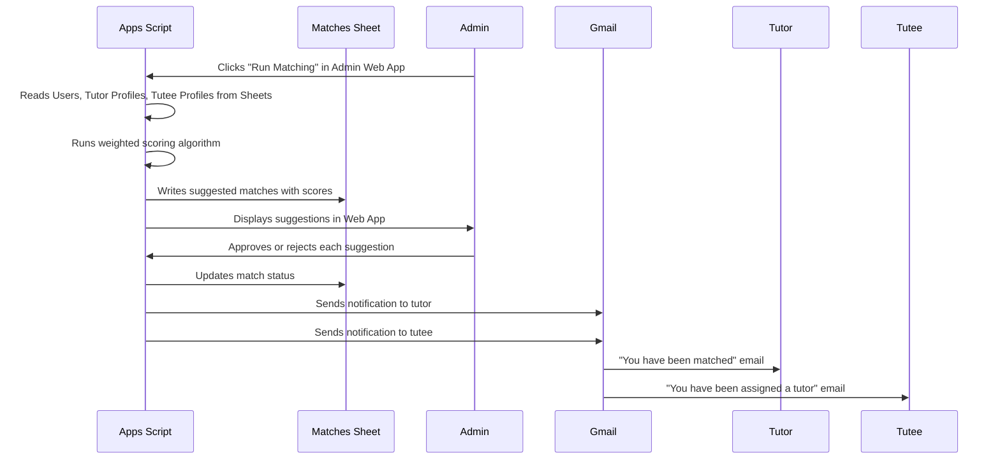

#### Workflow 3: Session Lifecycle

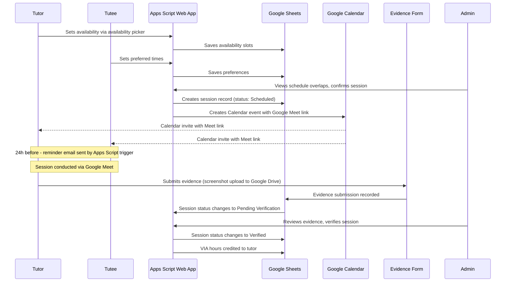

---

## 3. Architecture Overview

### 3.1 Architecture Pattern: Google Workspace-Native Application

Given the constraints (no technical staff, zero budget, modest user base, existing Google ecosystem usage), a **Google Workspace-native application** built entirely on Google Apps Script is the recommended architecture pattern.

**Rationale:**
- Zero infrastructure cost -- everything runs on Google's free infrastructure
- Zero maintenance -- no servers, no databases, no patching, no DevOps
- Familiar data layer -- admin already knows Google Sheets
- Native integrations -- Gmail, Calendar, Meet, Drive, Forms all accessible from Apps Script
- Built-in authentication -- Google account login handled automatically
- Built-in backup -- Google Sheets version history provides point-in-time recovery
- Browser-based development -- Apps Script editor requires no local development setup
- Sufficient for scale -- handles 100-500 users comfortably within Sheets and Apps Script limits

### 3.2 High-Level Architecture (Context Diagram)

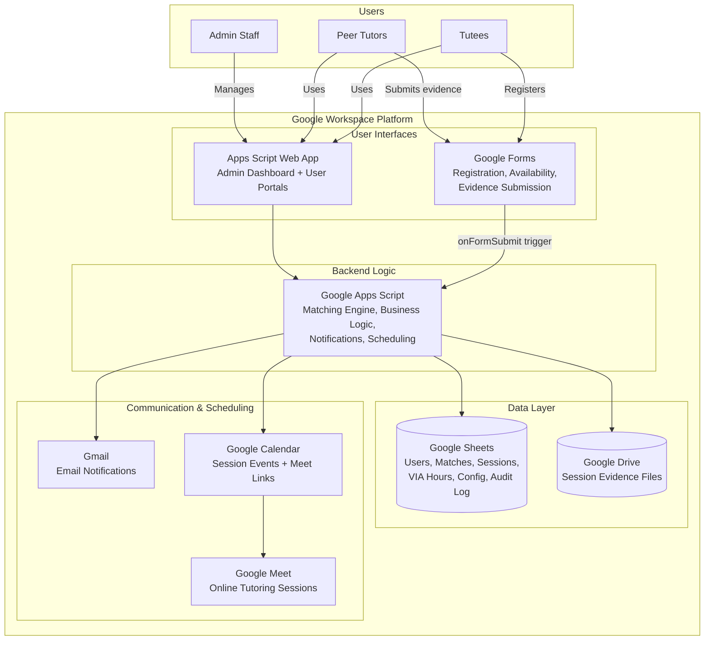

### 3.3 Container Diagram

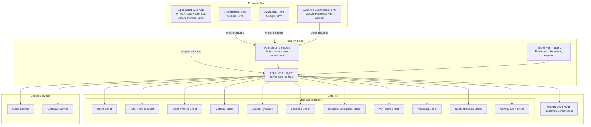

---

## 4. Component Architecture

### 4.1 Apps Script Module Structure

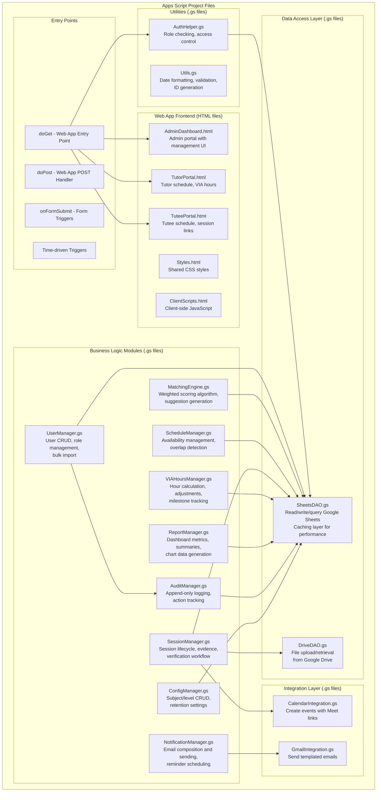

### 4.2 Module Responsibilities

| Module | File | Responsibility |
|---|---|---|
| **UserManager** | UserManager.gs | CRUD operations for users, role assignment, bulk import from Forms/CSV, profile management |
| **MatchingEngine** | MatchingEngine.gs | Runs weighted scoring algorithm against Sheets data, generates and ranks suggestions |
| **ScheduleManager** | ScheduleManager.gs | Manages availability slots, finds time overlaps between tutors and tutees |
| **SessionManager** | SessionManager.gs | Session lifecycle management, creates Calendar events with Meet links, handles evidence and verification |
| **VIAHoursManager** | VIAHoursManager.gs | Calculates hours from verified sessions, tracks cumulative totals, handles admin adjustments |
| **NotificationManager** | NotificationManager.gs | Composes and sends emails via Gmail for all notification types |
| **ReportManager** | ReportManager.gs | Generates dashboard metrics, aggregates data for admin reporting |
| **AuditManager** | AuditManager.gs | Append-only logging of all actions to the Audit Log sheet |
| **ConfigManager** | ConfigManager.gs | Reads/writes configuration (subjects, levels, retention settings) |
| **SheetsDAO** | SheetsDAO.gs | Data access layer abstracting Google Sheets read/write with caching |
| **DriveDAO** | DriveDAO.gs | Manages file uploads and retrieval from Google Drive |
| **CalendarIntegration** | CalendarIntegration.gs | Creates Google Calendar events with Google Meet conferencing |
| **GmailIntegration** | GmailIntegration.gs | Sends templated HTML emails via GmailApp |
| **AuthHelper** | AuthHelper.gs | Checks current user's email against Users sheet, enforces role-based access |
| **Utils** | Utils.gs | Shared utilities -- date formatting, UUID generation, input validation |

---

## 5. Data Architecture

### 5.1 Google Sheets Database Design

The "database" is a single Google Spreadsheet with multiple sheets (tabs) acting as tables. Each sheet has a header row defining column names.

#### Sheet: Users

| Column | Type | Description |
|---|---|---|
| user_id | String (UUID) | Auto-generated unique identifier |
| email | String | Google account email (unique) |
| name | String | Full name |
| phone | String | Phone number |
| school | String | School name |
| role | String | ADMIN, TUTOR, TUTEE, or TUTOR+TUTEE |
| is_active | Boolean | TRUE/FALSE |
| consent_received | Boolean | TRUE if offline parental consent received |
| created_at | DateTime | Account creation timestamp |
| updated_at | DateTime | Last update timestamp |
| deactivated_at | DateTime | Deactivation timestamp (if applicable) |

#### Sheet: Tutor Profiles

| Column | Type | Description |
|---|---|---|
| profile_id | String (UUID) | Auto-generated unique identifier |
| user_id | String (FK) | References Users.user_id |
| subjects_can_teach | String | Comma-separated list of subjects |
| class_levels | String | Comma-separated class levels |
| difficulty_levels | String | Comma-separated difficulty levels |
| rating | Number | Average rating (0.0-5.0) |
| total_sessions | Number | Count of verified sessions |
| available_for_matching | Boolean | TRUE if accepting new tutees |

#### Sheet: Tutee Profiles

| Column | Type | Description |
|---|---|---|
| profile_id | String (UUID) | Auto-generated unique identifier |
| user_id | String (FK) | References Users.user_id |
| subjects_needed | String | Comma-separated subjects |
| class_level | String | Current class level |
| difficulty_level | String | MOE difficulty level |
| academic_performance | String | Grade or performance indicator |
| lesson_type_pref | String | ONE_TO_ONE, GROUP, or BOTH |
| lesson_freq_pref | String | REGULAR, ADHOC, or BOTH |

#### Sheet: Matches

| Column | Type | Description |
|---|---|---|
| match_id | String (UUID) | Auto-generated unique identifier |
| tutor_user_id | String (FK) | References Users.user_id |
| tutee_user_id | String (FK) | References Users.user_id |
| subject | String | Matched subject |
| match_score | Number | Algorithm-calculated score (0-100) |
| status | String | SUGGESTED, APPROVED, REJECTED, COMPLETED, CANCELLED |
| lesson_type | String | ONE_TO_ONE or GROUP |
| lesson_frequency | String | REGULAR or ADHOC |
| rejection_reason | String | If rejected, reason provided by admin |
| approved_by | String | Admin email who approved |
| created_at | DateTime | Match creation timestamp |
| updated_at | DateTime | Last status change timestamp |

#### Sheet: Availability

| Column | Type | Description |
|---|---|---|
| slot_id | String (UUID) | Auto-generated unique identifier |
| user_id | String (FK) | References Users.user_id |
| day_of_week | String | MON, TUE, WED, THU, FRI, SAT, SUN |
| start_time | Time | Slot start time (e.g., 14:00) |
| end_time | Time | Slot end time (e.g., 16:00) |
| is_recurring | Boolean | TRUE for weekly recurring |
| specific_date | Date | For one-off availability |

#### Sheet: Sessions

| Column | Type | Description |
|---|---|---|
| session_id | String (UUID) | Auto-generated unique identifier |
| match_id | String (FK) | References Matches.match_id |
| scheduled_date | Date | Session date |
| start_time | Time | Session start time |
| end_time | Time | Session end time |
| duration_minutes | Number | Session duration |
| google_meet_link | String | Auto-generated Meet URL |
| calendar_event_id | String | Google Calendar event ID |
| status | String | SCHEDULED, IN_PROGRESS, PENDING_VERIFICATION, VERIFIED, CANCELLED |
| evidence_file_url | String | Google Drive link to uploaded evidence |
| evidence_submitted_at | DateTime | When tutor submitted evidence |
| verified_by | String | Admin email who verified |
| verified_at | DateTime | Verification timestamp |
| created_at | DateTime | Session creation timestamp |

#### Sheet: Session Participants

| Column | Type | Description |
|---|---|---|
| participant_id | String (UUID) | Auto-generated unique identifier |
| session_id | String (FK) | References Sessions.session_id |
| user_id | String (FK) | References Users.user_id |
| role | String | TUTOR or TUTEE |

#### Sheet: VIA Hours

| Column | Type | Description |
|---|---|---|
| via_id | String (UUID) | Auto-generated unique identifier |
| tutor_user_id | String (FK) | References Users.user_id |
| session_id | String (FK) | References Sessions.session_id (null for adjustments) |
| hours | Number | Hours credited (positive) or adjusted (can be negative) |
| type | String | EARNED or ADJUSTMENT |
| adjustment_reason | String | Reason for manual adjustment |
| adjusted_by | String | Admin email (for adjustments) |
| created_at | DateTime | Record creation timestamp |

#### Sheet: Audit Log

| Column | Type | Description |
|---|---|---|
| log_id | String (UUID) | Auto-generated unique identifier |
| timestamp | DateTime | When the action occurred |
| user_email | String | Who performed the action |
| action | String | Action type (e.g., USER_CREATED, MATCH_APPROVED, SESSION_VERIFIED) |
| entity_type | String | What was affected (USER, MATCH, SESSION, VIA_HOURS, CONFIG) |
| entity_id | String | ID of affected entity |
| details | String | JSON string with old and new values |

#### Sheet: Notification Log

| Column | Type | Description |
|---|---|---|
| notif_id | String (UUID) | Auto-generated unique identifier |
| timestamp | DateTime | When notification was sent |
| recipient_email | String | Email recipient |
| type | String | REMINDER, MATCH_ASSIGNED, SCHEDULE_CHANGE, VIA_MILESTONE |
| subject | String | Email subject line |
| status | String | SENT, FAILED |
| error_message | String | Error details if failed |

#### Sheet: Configuration

| Column | Type | Description |
|---|---|---|
| config_key | String | Configuration parameter name |
| config_value | String | Configuration value |
| description | String | Human-readable description |
| updated_at | DateTime | Last update timestamp |
| updated_by | String | Admin email who last changed it |

**Configuration entries include:**
- app_name (application display name, e.g., "Tuition Management System")
- org_name (organization name for branding)
- logo_url (Google Drive URL for logo image)
- primary_color (hex color for UI theme, e.g., "#1976D2")
- secondary_color (hex color for UI accents)
- label_tutor (customizable label for tutor role, e.g., "Tutor", "Mentor")
- label_tutee (customizable label for tutee role, e.g., "Tutee", "Student")
- label_session (customizable label for sessions, e.g., "Session", "Lesson")
- email_sender_name (display name for email notifications)
- email_footer (footer text for email notifications)
- subjects_list (comma-separated active subjects)
- class_levels_list (comma-separated class levels with sort order)
- difficulty_levels (JSON mapping subjects to difficulty levels)
- retention_days (default: 365)
- matching_weights (JSON with W1-W7 weights)
- reminder_hours_before (default: 24)
- via_milestones (comma-separated milestone hour values, e.g., 10,25,50,100)

### 5.2 Entity Relationship Diagram

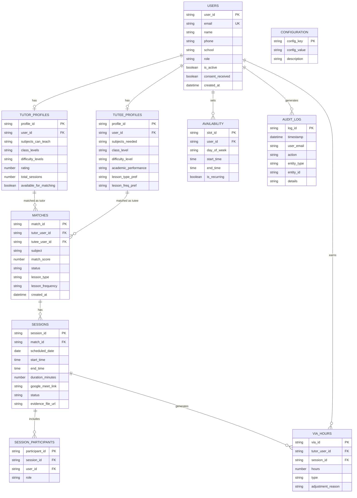

### 5.3 Data Volume Estimates

| Sheet | Year 1 | Year 3 | Year 5 | Within Sheets Limit? |
|---|---|---|---|---|
| Users | ~110 rows | ~133 rows | ~161 rows | Yes (10M cells) |
| Matches | ~200 rows | ~600 rows | ~1,200 rows | Yes |
| Sessions | ~2,000 rows | ~8,000 rows | ~18,000 rows | Yes |
| Availability | ~500 rows | ~700 rows | ~1,000 rows | Yes |
| VIA Hours | ~2,200 rows | ~9,000 rows | ~20,000 rows | Yes |
| Audit Log | ~20,000 rows | ~80,000 rows | ~180,000 rows | Yes (consider archival at Year 3+) |
| Evidence Files | ~1 GB | ~4 GB | ~9 GB | Google Drive: 15 GB free |

All volumes are well within Google Sheets and Drive limits for the projected 5-year growth.

---

## 6. Matching Algorithm Design

### 6.1 Algorithm Overview

The matching algorithm is implemented entirely in Apps Script (MatchingEngine.gs) and uses a **weighted scoring system** that reads tutor and tutee data from Google Sheets.

### 6.2 Scoring Model

```
Total Score = (W1 x Subject Score) + (W2 x Class Level Score) + (W3 x Difficulty Score)
            + (W4 x Frequency Score) + (W5 x Lesson Type Score)
            + (W6 x Schedule Overlap Score) + (W7 x Performance Score)
```

**Weights (configurable in Configuration sheet):**

| Criteria | Weight | Scoring Logic |
|---|---|---|
| Subject Match (W1) | 30 | Exact match = 1.0, No match = 0.0 |
| Class Level Match (W2) | 25 | Tutor must be higher level. 1 level above = 1.0, 2+ above = 0.8 |
| MOE Difficulty Level (W3) | 20 | Exact match = 1.0, Adjacent = 0.7, Mismatch = 0.0 |
| Lesson Frequency (W4) | 10 | Both prefer same = 1.0, Flexible = 0.8, Mismatch = 0.3 |
| Lesson Type (W5) | 5 | Both prefer same = 1.0, Flexible = 0.8, Mismatch = 0.3 |
| Schedule Overlap (W6) | 5 | Proportional to overlapping hours (0.0 - 1.0) |
| Tutor Performance (W7) | 5 | Based on rating (0.0 - 1.0), default 0.5 for new tutors |

**Total possible score: 100 points**

### 6.3 Algorithm Flow

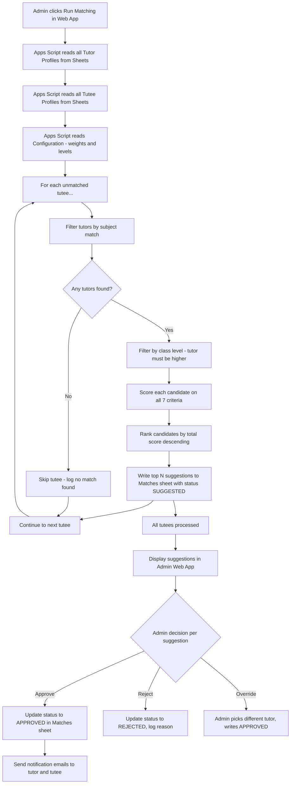

### 6.4 Apps Script Performance Considerations

- **Batch reads**: Read all sheet data at once using `getDataRange().getValues()` rather than row-by-row
- **In-memory processing**: All scoring happens in JavaScript arrays, not via sheet lookups
- **Batch writes**: Write all suggestions at once using `setValues()` instead of individual cell writes
- **Execution time**: For 100 users, the algorithm should complete in under 30 seconds
- **Caching**: Use CacheService for frequently accessed configuration data

### 6.5 Group Matching Extension

For group lessons (up to 50 students):
1. System identifies tutees with similar subject, level, and difficulty needs
2. Groups them by schedule overlap
3. Suggests a tutor who can serve the group
4. Admin approves the group composition and tutor assignment
5. A single session record is created with multiple entries in Session Participants sheet

---

## 7. Security Architecture

### 7.1 Security Model

Google Workspace provides the security foundation. The application adds role-based access control on top.

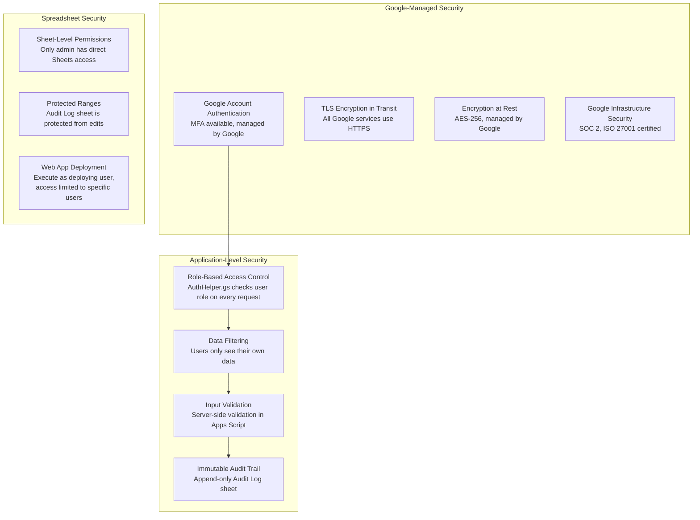

### 7.2 Authentication Flow

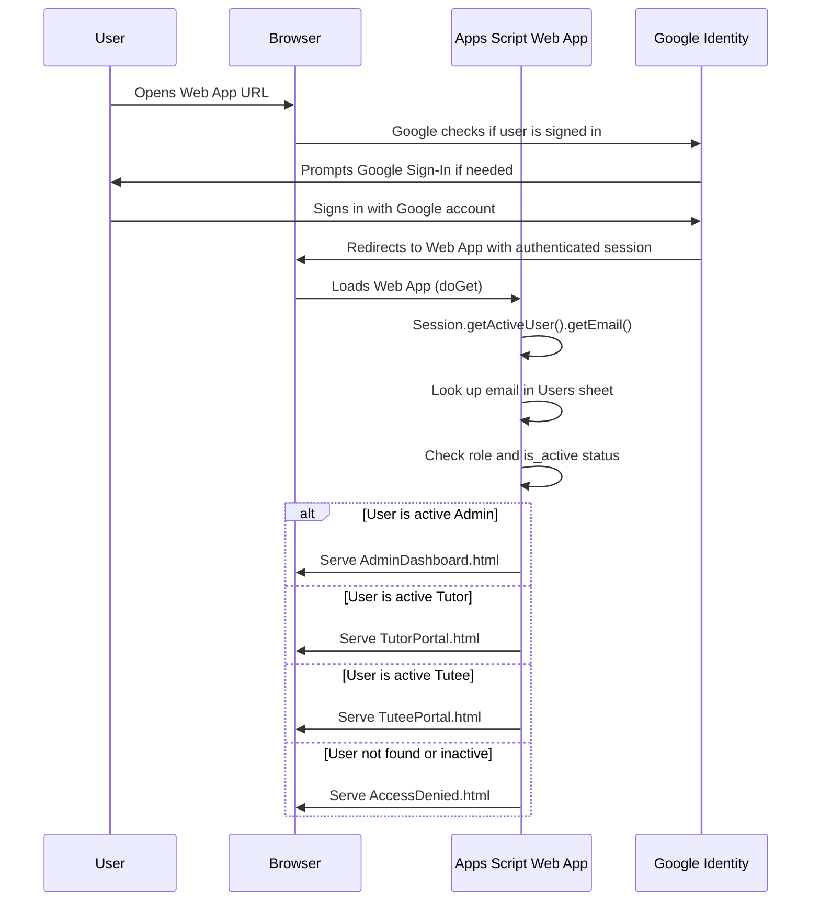

### 7.3 Security Controls Summary

| Control | Implementation |
|---|---|
| Authentication | Google Account sign-in (managed by Google, supports MFA) |
| Authorization | Apps Script checks user email against Users sheet + role column on every server-side call |
| Data access control | Web App filters data so users only see their own records; admin sees all |
| Encryption in transit | TLS managed by Google for all Apps Script Web App traffic |
| Encryption at rest | AES-256 managed by Google for Sheets, Drive, and all data |
| Audit logging | Append-only Audit Log sheet; protected range prevents manual edits |
| File upload security | Google Drive handles file type validation; script validates evidence is image |
| Spreadsheet access | Only admin Google accounts have direct access to the master spreadsheet |
| Web App access | Deployed with "Anyone with Google account" or restricted to specific domain |
| Input validation | Server-side validation in Apps Script before writing to Sheets |
| Rate limiting | Google imposes natural rate limits on Apps Script execution |

---

## 8. PDPA Compliance Design

### 8.1 PDPA Requirements for Minors

Since all users are minors (ages 12-18), Singapore's PDPA requires heightened data protection measures.

| PDPA Obligation | Implementation |
|---|---|
| **Consent** | Parental consent obtained offline (paper forms) before account creation. consent_received flag in Users sheet |
| **Purpose Limitation** | Data used only for tutoring matching, scheduling, session tracking, and VIA hours |
| **Data Minimization** | Only collect: name, email, phone, school, class level, academic performance |
| **Access Obligation** | Users can view all their personal data via the Web App |
| **Correction Obligation** | Users can request corrections via admin; admin updates in Sheets |
| **Withdrawal of Consent** | Admin deactivates account; data purged per retention policy |
| **Data Retention** | Configurable retention (default 1 year after deactivation); automated purging via scheduled trigger |
| **Data Protection** | Google-managed encryption at rest and in transit; RBAC via Apps Script |
| **Breach Notification** | Google infrastructure security; incident response procedures documented |
| **Transfer Limitation** | Google Workspace data residency can be configured; data processed by Google Singapore infrastructure |

### 8.2 Data Protection Impact Assessment (DPIA) Checklist

| Area | Risk Level | Mitigation |
|---|---|---|
| Personal data of minors | High | Offline parental consent, strict access controls, data minimization |
| Academic performance data | Medium | Role-based access, only admin sees all data, audit logging |
| Session evidence (screenshots) | Medium | Stored in Google Drive with restricted sharing; auto-deletion per retention |
| Google account linking | Low | Standard Google authentication, no additional credentials stored |
| Data in Google Sheets | Medium | Spreadsheet shared only with admin accounts; Web App mediates all other access |

### 8.3 Data Retention Automation

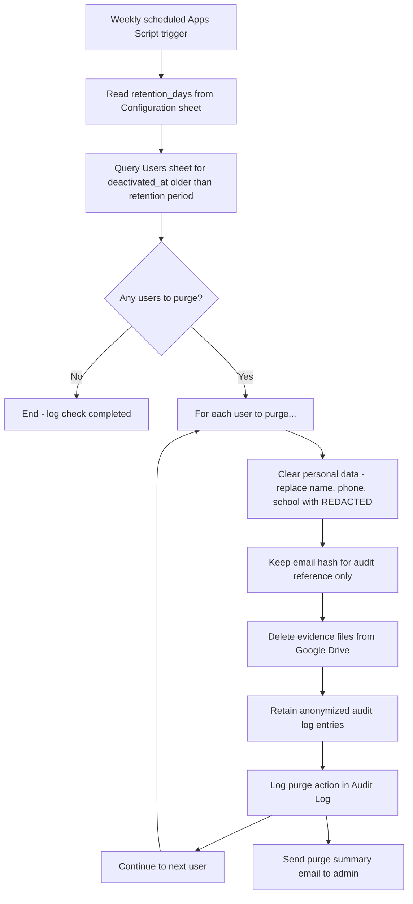

---

## 9. Infrastructure Architecture

### 9.1 Google Workspace Native Architecture

There is no separate infrastructure to manage. Everything runs on Google's platform.

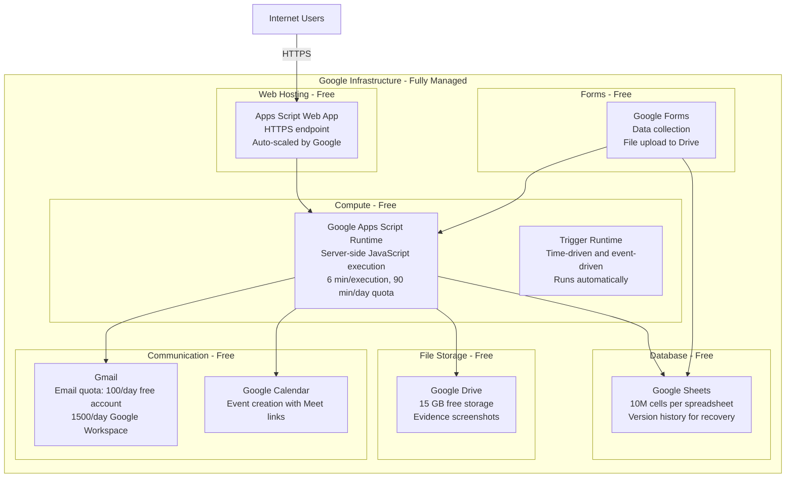

### 9.2 Google Apps Script Quotas and Limits

| Quota | Free Google Account | Google Workspace Account | Expected Usage | Sufficient? |
|---|---|---|---|---|
| Script runtime per execution | 6 minutes | 6 minutes | < 60 seconds | Yes |
| Total trigger runtime per day | 90 minutes | 6 hours | ~15 minutes | Yes |
| Email recipients per day | 100 | 1,500 | ~20-50 | Yes |
| Spreadsheet cells | 10,000,000 | 10,000,000 | ~500,000 (Year 5) | Yes |
| URL Fetch calls per day | 20,000 | 100,000 | ~200 | Yes |
| Drive storage | 15 GB | 30 GB+ | ~9 GB (Year 5) | Yes |
| Calendar events created | 5,000/day | 5,000/day | ~20/day max | Yes |
| Simultaneous users (Web App) | ~30 | ~30 | ~10-20 peak | Yes |
| Properties storage | 500KB | 500KB | ~10KB config | Yes |

### 9.3 Cost Analysis

| Component | Cost | Notes |
|---|---|---|
| Google Apps Script | $0 | Free for all Google accounts |
| Google Sheets | $0 | Free with Google account |
| Google Forms | $0 | Free with Google account |
| Google Drive (15 GB) | $0 | Free with Google account |
| Gmail (100 emails/day) | $0 | Free with Google account |
| Google Calendar | $0 | Free with Google account |
| Google Meet | $0 | Free with Google account (60-min limit for free; no limit with Workspace) |
| Custom domain (optional) | $0-12/year | Optional, Apps Script provides a google.com URL |
| **Total Monthly Cost** | **$0** | Completely free |

**Note on Google Workspace**: If the organization needs higher email quotas (1,500/day vs 100/day) or longer Google Meet sessions, a Google Workspace subscription ($6/user/month for a single admin account) would be the only cost. For 100 users and ~20-50 emails/day, the free Google account is sufficient.

---

## 10. Technology Stack Recommendations

### 10.1 Option A: Google Apps Script + Workspace (Recommended)

| Category | Technology | Justification |
|---|---|---|
| **Backend Runtime** | Google Apps Script (server-side JavaScript) | Free, zero infrastructure, native Google service access |
| **Frontend** | HTML Service (HTML + CSS + vanilla JS served by Apps Script) | No build tools needed, served directly by Apps Script |
| **UI Framework** | CSS framework (Materialize CSS or Bootstrap via CDN) | Mobile-responsive, clean components, no build step |
| **Database** | Google Sheets (SpreadsheetApp) | Free, admin-visible, version history, familiar |
| **Authentication** | Google Account (Session.getActiveUser()) | Native, free, secure, no implementation needed |
| **File Storage** | Google Drive (DriveApp) | Free 15GB, native integration |
| **Email** | Gmail (GmailApp/MailApp) | Free, native, HTML email support |
| **Meeting Links** | Google Calendar + Meet (CalendarApp) | Native, creates Meet links automatically |
| **Data Collection** | Google Forms | Free, native, file upload support |
| **Scheduling (Cron)** | Apps Script Time-driven Triggers | Free, built-in, configurable intervals |
| **Version Control** | Apps Script built-in versioning + clasp CLI for GitHub sync | Script versions built-in; clasp enables Git workflow |
| **Monitoring** | Apps Script Execution Log + email alerts on failure | Built-in execution logging |

**Pros:**
- Completely free -- zero cost for infrastructure, hosting, database, email, storage
- Zero maintenance -- no servers, no databases, no Docker, no Kubernetes
- Familiar to admin -- data visible and editable in Google Sheets
- Native Google integrations -- Gmail, Calendar, Meet, Drive, Forms all built-in
- Built-in authentication -- Google account login with no additional setup
- Built-in backup -- Google Sheets version history provides instant recovery
- Browser-based development -- no local development environment needed
- Instant deployment -- publish new version from Apps Script editor

**Cons:**
- Apps Script execution limits (6 min per run, 90 min/day for free accounts)
- Web App has initial load latency (~2-5 seconds)
- Limited UI capabilities compared to modern web frameworks (no React, no component library)
- JavaScript only (no TypeScript natively, though clasp supports it)
- Google Sheets is not a real database (no transactions, no referential integrity enforcement)
- Concurrency limitations (~30 simultaneous Web App users)
- Vendor lock-in to Google ecosystem

**Estimated Monthly Cost: $0**

### 10.2 Option B: Google Apps Script + AppSheet (Low-Code Alternative)

| Category | Technology | Justification |
|---|---|---|
| **Frontend** | AppSheet (Google's no-code app builder) | Drag-and-drop UI, mobile-native, reads from Sheets |
| **Backend** | Google Apps Script (for complex logic) | Matching algorithm, notifications, VIA calculations |
| **Database** | Google Sheets | Same as Option A |
| **Auth** | Google Account via AppSheet | Built-in |
| **All other services** | Same as Option A | Gmail, Calendar, Drive, Forms |

**Pros:**
- Even faster to build UI -- drag-and-drop interface builder
- Native mobile app generation (iOS + Android) at no cost
- AppSheet handles CRUD operations automatically from Sheets
- Role-based views built into AppSheet
- No HTML/CSS/JS needed for frontend

**Cons:**
- AppSheet free tier is limited (10 users max for free, then $5/user/month)
- Less customizable UI than hand-coded HTML
- Complex matching algorithm still needs Apps Script
- Two platforms to manage (AppSheet + Apps Script)
- 10-user free limit makes this impractical without a paid plan for 100 users

**Estimated Monthly Cost: $500/month** (100 users x $5/user for AppSheet) -- NOT recommended due to cost

### 10.3 Option C: Google Apps Script + Looker Studio (Reporting Enhancement)

This is an extension of Option A, not a replacement.

| Category | Technology | Justification |
|---|---|---|
| **Everything** | Same as Option A | Core platform unchanged |
| **Reporting** | Google Looker Studio (free) | Connected to Google Sheets for advanced dashboards |

**Pros:**
- All Option A benefits plus professional-grade reporting dashboards
- Looker Studio is free and connects directly to Google Sheets
- Interactive charts, filters, and drill-down capabilities
- Shareable reports with specific users
- Auto-refreshes from Sheets data

**Cons:**
- Additional tool for admin to learn
- Reports are view-only (not actionable -- cannot approve matches from a report)

**Estimated Monthly Cost: $0** (Looker Studio is free)

### 10.4 Recommendation Matrix

| Criteria | Option A (Apps Script) | Option B (AppSheet) | Option C (Apps Script + Looker) |
|---|---|---|---|
| Development Speed | High | Highest | High |
| Maintainability | High | Medium | High |
| Flexibility | High | Low | High |
| UI Quality | Good | Excellent (native mobile) | Good + Excellent reports |
| Infrastructure Simplicity | Highest | High | Highest |
| Cost | $0 | $500/month | $0 |
| Learning Curve | Low | Lowest | Low-Medium |
| Scale Ceiling | ~500 users | ~500 users | ~500 users |

**Final Recommendation: Option A (Google Apps Script + Workspace)** as the primary stack, with **Option C (Looker Studio)** added in Phase 3 for enhanced reporting. Option B is ruled out due to cost.

---

## 11. Apps Script Module Design

### 11.1 Project File Structure

```
tuition_management_system/
  appsscript.json          -- Project manifest (scopes, runtime version)
  Code.gs                  -- Entry points (doGet, doPost, includes)
  AuthHelper.gs            -- Authentication and role checking
  UserManager.gs           -- User CRUD operations
  MatchingEngine.gs        -- Matching algorithm
  ScheduleManager.gs       -- Availability and scheduling
  SessionManager.gs        -- Session lifecycle management
  VIAHoursManager.gs       -- VIA hours calculation and tracking
  NotificationManager.gs   -- Email notification sending
  ReportManager.gs         -- Dashboard metrics and reporting
  AuditManager.gs          -- Immutable audit logging
  ConfigManager.gs         -- Configuration management
  SheetsDAO.gs             -- Data access layer for Sheets
  DriveDAO.gs              -- Data access layer for Drive
  CalendarIntegration.gs   -- Google Calendar and Meet integration
  GmailIntegration.gs      -- Email sending utilities
  Utils.gs                 -- Shared utility functions
  AdminDashboard.html      -- Admin portal UI
  TutorPortal.html         -- Tutor portal UI
  TuteePortal.html         -- Tutee portal UI
  SharedStyles.html        -- Shared CSS (included via includes)
  SharedScripts.html       -- Shared client-side JS
  AccessDenied.html        -- Unauthorized access page
```

### 11.2 Key Code Patterns

#### Entry Point (Code.gs)

```javascript
// Web App entry point
function doGet(e) {
  var user = AuthHelper.getCurrentUser();
  if (!user) return HtmlService.createHtmlOutputFromFile('AccessDenied');

  var page = e.parameter.page || 'dashboard';
  var template;

  switch (user.role) {
    case 'ADMIN':
      template = HtmlService.createTemplateFromFile('AdminDashboard');
      break;
    case 'TUTOR':
      template = HtmlService.createTemplateFromFile('TutorPortal');
      break;
    case 'TUTEE':
      template = HtmlService.createTemplateFromFile('TuteePortal');
      break;
    default:
      return HtmlService.createHtmlOutputFromFile('AccessDenied');
  }

  template.user = user;
  template.page = page;
  var appName = ConfigManager.get('app_name') || 'Tuition Management System';
  return template.evaluate()
    .setTitle(appName)
    .addMetaTag('viewport', 'width=device-width, initial-scale=1')
    .setXFrameOptionsMode(HtmlService.XFrameOptionsMode.ALLOWALL);
}

// Include HTML partials
function include(filename) {
  return HtmlService.createHtmlOutputFromFile(filename).getContent();
}
```

#### Data Access Pattern (SheetsDAO.gs)

```javascript
var SheetsDAO = (function() {
  var SPREADSHEET_ID = 'your-spreadsheet-id-here';
  var cache = {};

  function getSheet(sheetName) {
    return SpreadsheetApp.openById(SPREADSHEET_ID).getSheetByName(sheetName);
  }

  function getAllRows(sheetName) {
    var sheet = getSheet(sheetName);
    var data = sheet.getDataRange().getValues();
    var headers = data[0];
    var rows = [];
    for (var i = 1; i < data.length; i++) {
      var row = {};
      for (var j = 0; j < headers.length; j++) {
        row[headers[j]] = data[i][j];
      }
      rows.push(row);
    }
    return rows;
  }

  function findByColumn(sheetName, column, value) {
    var rows = getAllRows(sheetName);
    return rows.filter(function(row) { return row[column] === value; });
  }

  function appendRow(sheetName, rowData) {
    var sheet = getSheet(sheetName);
    sheet.appendRow(rowData);
  }

  function updateRow(sheetName, matchColumn, matchValue, updates) {
    var sheet = getSheet(sheetName);
    var data = sheet.getDataRange().getValues();
    var headers = data[0];
    var colIndex = headers.indexOf(matchColumn);
    for (var i = 1; i < data.length; i++) {
      if (data[i][colIndex] === matchValue) {
        for (var key in updates) {
          var updateColIndex = headers.indexOf(key);
          if (updateColIndex >= 0) {
            sheet.getRange(i + 1, updateColIndex + 1).setValue(updates[key]);
          }
        }
        return true;
      }
    }
    return false;
  }

  return {
    getAllRows: getAllRows,
    findByColumn: findByColumn,
    appendRow: appendRow,
    updateRow: updateRow,
    getSheet: getSheet
  };
})();
```

#### Matching Engine Pattern (MatchingEngine.gs)

```javascript
var MatchingEngine = (function() {
  function generateSuggestions() {
    var config = ConfigManager.getMatchingWeights();
    var tutors = SheetsDAO.getAllRows('Tutor Profiles')
      .filter(function(t) { return t.available_for_matching === true; });
    var tutees = SheetsDAO.getAllRows('Tutee Profiles');
    var users = SheetsDAO.getAllRows('Users')
      .filter(function(u) { return u.is_active === true; });
    var existingMatches = SheetsDAO.getAllRows('Matches')
      .filter(function(m) { return m.status === 'APPROVED' || m.status === 'SUGGESTED'; });

    var suggestions = [];

    tutees.forEach(function(tutee) {
      // Skip if tutee already has an approved match for this subject
      var alreadyMatched = existingMatches.some(function(m) {
        return m.tutee_user_id === tutee.user_id && m.subject === tutee.subjects_needed;
      });
      if (alreadyMatched) return;

      var candidates = [];
      tutors.forEach(function(tutor) {
        // Cannot tutor yourself
        if (tutor.user_id === tutee.user_id) return;

        var score = calculateScore(tutor, tutee, config);
        if (score > 0) {
          candidates.push({ tutor: tutor, score: score });
        }
      });

      // Sort by score descending, take top 3
      candidates.sort(function(a, b) { return b.score - a.score; });
      candidates.slice(0, 3).forEach(function(c) {
        suggestions.push({
          tutor_user_id: c.tutor.user_id,
          tutee_user_id: tutee.user_id,
          subject: tutee.subjects_needed,
          match_score: c.score,
          status: 'SUGGESTED'
        });
      });
    });

    // Batch write suggestions to Matches sheet
    writeSuggestions(suggestions);
    AuditManager.log('SYSTEM', 'MATCHING_RUN', 'MATCH', null,
      JSON.stringify({ suggestions_count: suggestions.length }));

    return suggestions;
  }

  function calculateScore(tutor, tutee, config) {
    var score = 0;
    // W1: Subject match
    if (tutor.subjects_can_teach.indexOf(tutee.subjects_needed) >= 0) {
      score += config.W1 * 1.0;
    } else {
      return 0; // Subject match is mandatory
    }
    // W2-W7: Additional criteria scoring
    score += config.W2 * scoreClassLevel(tutor, tutee);
    score += config.W3 * scoreDifficulty(tutor, tutee);
    score += config.W4 * scoreFrequency(tutor, tutee);
    score += config.W5 * scoreLessonType(tutor, tutee);
    score += config.W6 * scoreScheduleOverlap(tutor, tutee);
    score += config.W7 * scorePerformance(tutor);
    return Math.round(score * 100) / 100;
  }

  // ... individual scoring functions ...

  return { generateSuggestions: generateSuggestions };
})();
```

### 11.3 Trigger Configuration

| Trigger | Type | Schedule | Function | Purpose |
|---|---|---|---|---|
| Session Reminders | Time-driven | Every hour | sendSessionReminders() | Check for sessions in 24h, send reminder emails |
| Data Retention | Time-driven | Weekly (Sunday 3AM) | runDataRetention() | Purge data past retention period |
| Registration Form | Form submit | On submission | onRegistrationSubmit(e) | Process new user registrations |
| Availability Form | Form submit | On submission | onAvailabilitySubmit(e) | Process availability updates |
| Evidence Form | Form submit | On submission | onEvidenceSubmit(e) | Process session evidence uploads |

---

## 12. Phased Development Roadmap

### Phase 1: MVP / Prototype (Weeks 1-3)

**Goal**: Digitize the current manual workflow -- user management, basic matching, session creation

| Week | Deliverables |
|---|---|
| Week 1 | Create master Google Spreadsheet with all sheets and headers. Build SheetsDAO.gs, Utils.gs, AuthHelper.gs. Create Google Form for student registration with onFormSubmit trigger. Basic Web App (doGet) with role-based routing. |
| Week 2 | Build UserManager.gs (CRUD + bulk import). Build basic MatchingEngine.gs (subject + class level only). Admin Web App page showing user list and match suggestions. Approve/reject match workflow. |
| Week 3 | Build SessionManager.gs with Google Calendar integration (auto-generates Meet links). Basic notification emails (match assigned, session scheduled). Tutor and Tutee portals showing their matches and upcoming sessions. |

**Deliverables at end of Phase 1:**
- Master spreadsheet with all data sheets created
- Registration via Google Form works
- Admin can view users and run basic matching
- Sessions can be created with Google Meet links auto-generated via Calendar
- Basic email notifications for matches and sessions
- Three role-based Web App portals functional

### Phase 2: Core Features (Weeks 4-6)

**Goal**: Complete all must-have features for operational use

| Week | Deliverables |
|---|---|
| Week 4 | Build ScheduleManager.gs -- availability forms for tutors and tutees, overlap detection. Build full matching algorithm with all 7 weighted criteria. Configuration sheet for subjects, levels, matching weights. |
| Week 5 | Build evidence submission via Google Form with file upload. Build SessionManager verification workflow. Build VIAHoursManager.gs -- auto-calculation on verification, cumulative tracking. Tutor portal shows VIA hours. |
| Week 6 | Build ReportManager.gs -- admin dashboard metrics. Build AuditManager.gs -- append-only logging on all actions. Subject/level configuration UI for admin. Bulk match approval workflow. |

**Deliverables at end of Phase 2:**
- Full matching algorithm with weighted scoring
- Availability management and schedule overlap detection
- Complete session lifecycle (schedule, conduct, evidence, verify)
- VIA hours automatically calculated and visible to tutors
- Admin reporting dashboard with key metrics
- Audit trail logging all actions
- Admin can configure subjects, levels, and matching weights

### Phase 3: Hardening and Polish (Weeks 7-9)

**Goal**: Production readiness -- notifications, data retention, UI polish, testing

| Week | Deliverables |
|---|---|
| Week 7 | Build NotificationManager.gs -- session reminders (24h), VIA milestones. Set up time-driven triggers for reminders and retention. Data retention automation (weekly purge trigger). |
| Week 8 | UI/UX polish -- mobile-responsive design, consistent styling. Add Materialize CSS or Bootstrap for cleaner UI. Error handling and user-friendly error messages. Input validation on all forms. |
| Week 9 | Testing all workflows end-to-end. PDPA compliance review -- consent flags, data minimization, retention. Documentation (admin user guide). Protected ranges on Audit Log sheet. Optional: Connect Looker Studio for advanced reporting. |

**Deliverables at end of Phase 3:**
- Automated session reminders and VIA milestone notifications
- Data retention automation running weekly
- Mobile-responsive, polished UI
- Comprehensive input validation and error handling
- PDPA compliance verified
- Admin user guide document
- System ready for production use

### Phase 4: Launch and Stabilization (Weeks 10-11)

**Goal**: Go live and onboard users

| Week | Deliverables |
|---|---|
| Week 10 | Final testing with real data. Deploy Web App as production version. Share Web App URL and Form links with users. Admin training session. |
| Week 11 | Monitor for issues, fix bugs. Collect user feedback. Adjust matching weights based on admin feedback. |

**Deliverables at end of Phase 4:**
- System live and operational
- Admin trained on all features
- Users onboarded and using the system
- Initial bugs resolved

### Phase 5: Continuous Improvement (Ongoing)

| Priority | Enhancement |
|---|---|
| High | Improve matching algorithm based on admin approval/rejection patterns |
| High | Add Looker Studio dashboards for advanced analytics |
| Medium | Move toward fully automated matching (reduce admin intervention) |
| Medium | Group lesson workflow improvements |
| Low | Mobile app wrapper (PWA or AppSheet for specific features) |
| Low | Parent view portal (if demand arises) |
| Low | Automated report emails (weekly summary to admin) |

### Development Timeline Summary

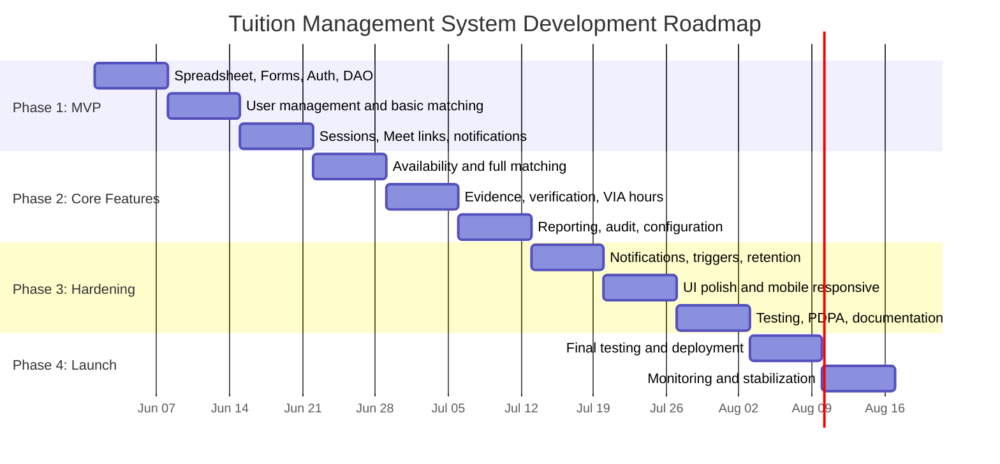

**Total time to launch: 11 weeks** (reduced from 14 weeks due to simpler architecture)

---

## 13. AWS Well-Architected Framework Analysis

Although hosted entirely on Google Workspace (not AWS or any cloud compute), the six pillars remain an excellent evaluation framework.

### 13.1 Operational Excellence

| Aspect | Implementation |
|---|---|
| Infrastructure as Code | Not applicable -- no infrastructure to manage |
| Observability | Apps Script Execution Logs, email alerts on trigger failures |
| Deployments | Apps Script versioned deployments from browser editor; clasp CLI for Git-based workflow |
| Runbooks | Admin user guide documenting all operations |
| Incident management | Trigger failure alerts via email; admin can inspect Sheets directly |
| Change management | Apps Script version history; rollback to previous deployment |

### 13.2 Security

| Aspect | Implementation |
|---|---|
| Identity and access | Google Account authentication (MFA available), RBAC in Apps Script |
| Detection | Audit Log sheet records all actions; admin reviews periodically |
| Infrastructure protection | Fully managed by Google (SOC 2, ISO 27001, SSAE 16 certified) |
| Data protection | AES-256 at rest (Google-managed), TLS in transit, Sheets share restrictions |
| Incident response | Documented PDPA breach notification procedure; Google handles infrastructure incidents |

### 13.3 Reliability

| Aspect | Implementation |
|---|---|
| Fault tolerance | Google infrastructure SLA 99.9%; no single points of failure in Google's platform |
| Recovery | Google Sheets version history for instant point-in-time recovery; RTO < 1 hour |
| Graceful degradation | If Apps Script fails, admin can still access data directly in Sheets |
| Change management | Apps Script versioned deployments with rollback capability |
| Backup | Google Sheets auto-saves continuously; Drive file versioning |

### 13.4 Performance Efficiency

| Aspect | Implementation |
|---|---|
| Batch processing | Read/write entire sheets at once using getValues()/setValues() |
| Caching | CacheService for frequently accessed configuration data |
| Optimization | In-memory array processing for matching algorithm; minimize Sheets API calls |
| Limitations | Web App initial load ~2-5 seconds; script execution limit 6 minutes |
| Mitigation | Batch operations, progress indicators for long-running tasks |

### 13.5 Cost Optimization

| Aspect | Implementation |
|---|---|
| Total cost | $0 per month -- everything within Google free tier |
| No infrastructure costs | No servers, no database, no hosting, no CDN |
| No vendor costs | All Google services used are free tier |
| Growth buffer | Free tier handles 5+ years of projected growth |
| Upgrade path | Google Workspace ($6/user/month) only if email quota or Meet limits are hit |

### 13.6 Sustainability

| Aspect | Implementation |
|---|---|
| Efficient utilization | No idle servers -- Apps Script runs on-demand only |
| Shared infrastructure | Google's globally optimized data centers |
| Data lifecycle | Automated retention and purging reduces storage footprint |
| Minimal footprint | No containers, no VMs, no build pipelines |

---

## 14. Trade-off Analysis

### 14.1 Architecture Trade-offs

| Decision | Option A | Option B | Chosen | Rationale |
|---|---|---|---|---|
| Architecture | Traditional web app (Next.js + Supabase) | Google Apps Script + Sheets | Google Apps Script | Zero cost, zero maintenance, admin-familiar data layer |
| Database | PostgreSQL (Supabase) | Google Sheets | Google Sheets | No DBA needed, admin can inspect/edit directly, free |
| Frontend | React (Next.js) | Apps Script HTML Service | HTML Service | No build tools, no npm, no deployment pipeline needed |
| Hosting | Cloud Run / Vercel | Apps Script Web App | Apps Script Web App | Zero cost, auto-managed, HTTPS by default |
| Auth | Supabase Auth (OAuth) | Google Account (native) | Google Account | Built-in, zero configuration, secure |
| File storage | Supabase Storage / GCS | Google Drive | Google Drive | 15 GB free, native, admin-accessible |

### 14.2 Scalability vs. Performance vs. Cost Matrix

| Component | Scalability | Performance | Cost | Overall |
|---|---|---|---|---|
| Apps Script Web App | Low-Medium (~30 concurrent) | Moderate (2-5s initial load) | Free | Good for this use case |
| Google Sheets as DB | Low-Medium (~500 users, ~200K rows) | Moderate (batch reads fast, individual slow) | Free | Sufficient for 5+ years |
| Google Drive storage | High (15 GB free) | Good | Free | Sufficient for 5+ years |
| Gmail notifications | Low (100/day free) | Good | Free | Sufficient for 100 users |
| Google Calendar/Meet | High | Excellent | Free | Excellent |

### 14.3 Key Trade-off Decisions

**1. Google Sheets vs. Real Database**
- Google Sheets: Free, admin-editable, no maintenance, version history
- PostgreSQL: Transactions, referential integrity, better query performance, indexing
- **Decision**: Google Sheets. At 100-500 users, the limitations are not impactful. Admin ability to inspect and edit data directly is a major advantage given no technical staff.

**2. Apps Script Web App vs. Modern SPA**
- Apps Script Web App: Free hosting, simple deployment, limited UI capabilities, slower initial load
- React/Next.js: Rich UI, fast interactions, requires hosting, build pipeline, and maintenance
- **Decision**: Apps Script Web App. The simpler UI is acceptable for this use case. The zero-cost, zero-maintenance trade-off outweighs UI richness.

**3. Forms-based Data Entry vs. Custom Forms**
- Google Forms: Free, mobile-friendly, file upload built-in, auto-populates Sheets, but limited customization
- Custom forms in Web App: More control over validation and UX, but requires more development
- **Decision**: Hybrid. Use Google Forms for data collection (registration, evidence submission) and custom forms in the Web App for admin operations and matching workflows.

**4. Email Quota (100/day Free vs. 1,500/day Workspace)**
- Free Google account: 100 recipients/day via MailApp, sufficient for daily operations
- Google Workspace: 1,500/day, plus better deliverability and custom domain
- **Decision**: Start with free account. If email needs exceed 100/day, upgrade admin account to Workspace ($6/month for one user).

### 14.4 What You Gain vs. What You Lose (vs. Traditional Web App)

| Aspect | Google Apps Script Approach | Traditional Web App Approach |
|---|---|---|
| **Cost** | $0/month | $0-25/month (free tiers can expire) |
| **Maintenance effort** | Near zero | Moderate (updates, patches, monitoring) |
| **Admin data access** | Direct Sheets access (familiar) | Through application UI only |
| **UI quality** | Basic (HTML + CSS, no React) | Modern (React, component libraries) |
| **Performance** | Moderate (2-5s loads) | Good (< 1s with SSR/caching) |
| **Scalability ceiling** | ~500 users, ~30 concurrent | Thousands of users |
| **Offline resilience** | Admin can still use Sheets if script fails | Full outage if server down |
| **Development speed** | Fast (no build tools, no infra) | Moderate (project setup, CI/CD) |
| **Testing** | Manual + basic script testing | Automated test suites |
| **Vendor lock-in** | Google ecosystem | Moderate (depends on choices) |

---

## 15. Hosting Recommendations

### 15.1 Option Comparison

With the Google Apps Script approach, "hosting" is fundamentally different -- there is no infrastructure to host.

| Criteria | On-Premise | Cloud (Traditional) | Google Workspace (Chosen) |
|---|---|---|---|
| **Upfront Cost** | High (hardware) | None | None |
| **Monthly Cost** | Electricity, internet | $0-25 (free tiers) | $0 |
| **Maintenance** | High (requires staff) | Low-Moderate | Near zero |
| **Infrastructure** | Servers, networking | Cloud compute, databases | None -- fully managed by Google |
| **Scalability** | Limited | High | Moderate (sufficient for use case) |
| **Data Sovereignty** | Full control | Configurable by region | Google manages; configurable in Workspace |
| **Disaster Recovery** | Complex to set up | Depends on architecture | Built-in (Sheets version history) |
| **Technical Staff Required** | Yes | Some | None |
| **Suitability** | Not recommended | Alternative option | Recommended |

### 15.2 Recommendation: Google Workspace-Native (No Separate Hosting Required)

**Strong recommendation for Google Workspace-native hosting** given the constraints:
- Zero cost
- Zero maintenance
- No technical staff available
- Admin already comfortable with Google Sheets and Forms
- All Google services are free and sufficient for projected scale
- Built-in backup and recovery via Sheets version history
- Google's infrastructure provides 99.9% SLA

### 15.3 Cost Projection

| Timeframe | Users | Estimated Monthly Cost | Notes |
|---|---|---|---|
| Year 1 | 100-110 | $0 | All within free tier |
| Year 2 | 110-121 | $0 | All within free tier |
| Year 3 | 121-133 | $0 | All within free tier |
| Year 5 | 146-161 | $0 | Still within free tier limits |
| If email quota exceeded | Any | $6/month | Single Workspace account for admin |
| If major growth (500+) | 500+ | Consider re-architecture to traditional web app | Migrate data from Sheets to PostgreSQL |

---

## 16. Risk Register

| ID | Risk | Likelihood | Impact | Mitigation |
|---|---|---|---|---|
| R1 | Google Apps Script quota limits hit (90 min/day) | Low | Medium | Optimize scripts for batch operations; most operations take < 60 seconds. Monitor execution logs. |
| R2 | Google Sheets performance degrades with large data | Low | Medium | Archive old data (sessions, audit logs) to separate spreadsheets yearly. Data volumes are small. |
| R3 | Web App concurrent user limit (~30) | Low | Low | Only ~10-20 users access simultaneously. Peak usage is spread across time. |
| R4 | Google changes Apps Script quotas or pricing | Low | High | Architecture is documented; data in Sheets is exportable; can migrate to traditional web app if needed. |
| R5 | PDPA compliance breach | Low | Critical | Privacy by design, audit logging, offline consent, data minimization, automated retention. |
| R6 | No technical staff for bug fixes | High | Medium | Well-documented code with inline comments; standard JavaScript; any developer can pick up Apps Script quickly. |
| R7 | Gmail email deliverability issues | Medium | Medium | Monitor notification log sheet for failures; switch to Workspace if needed ($6/month). |
| R8 | Matching algorithm produces poor suggestions | Medium | Medium | Admin approval gate catches bad matches; configurable weights allow tuning; algorithm improved over time. |
| R9 | Data integrity issues (no DB constraints in Sheets) | Medium | Medium | Apps Script enforces validation before writes; audit log tracks all changes; Sheets version history for recovery. |
| R10 | Google account of project owner compromised | Low | Critical | Enable MFA on admin accounts; share spreadsheet with backup admin; Apps Script project shared with backup owner. |
| R11 | Web App initial load latency frustrates users | Medium | Low | Set user expectations; add loading indicator; 2-5 seconds is acceptable per requirements. |
| R12 | Google Meet 60-minute limit (free accounts) | Medium | Medium | Sessions typically < 60 minutes. If longer needed, upgrade to Workspace or use Jitsi Meet as fallback. |

---

## 17. Appendices

### Appendix A: Glossary

| Term | Definition |
|---|---|
| **VIA** | Values in Action -- Singapore MOE community service program where students earn service hours |
| **MOE** | Ministry of Education, Singapore |
| **PDPA** | Personal Data Protection Act 2012, Singapore's data privacy law |
| **IP** | Integrated Programme -- accelerated academic track in Singapore secondary education |
| **O-Level** | GCE Ordinary Level examinations |
| **N-Level** | GCE Normal Level examinations |
| **A-Level** | GCE Advanced Level examinations |
| **Lower Secondary** | Secondary 1 and 2 (ages 13-14) |
| **Upper Secondary** | Secondary 3 and 4/5 (ages 15-17) |
| **Peer tutoring** | Tutoring model where older students tutor younger students |
| **Google Apps Script** | JavaScript-based scripting platform built into Google Workspace |
| **Apps Script Web App** | A web application served by Google Apps Script via doGet()/doPost() functions |
| **clasp** | Command Line Apps Script Projects -- CLI tool for local Apps Script development with Git |
| **Google Meet** | Google's video conferencing service, integrated with Google Calendar |
| **Looker Studio** | Google's free business intelligence and reporting tool (formerly Google Data Studio) |
| **Tuition Management System** | The name of this application; designed as a white-label solution deployable for multiple organizations |
| **White-label** | A product designed to be rebranded by different organizations without code changes |

### Appendix B: Decision Log

| Date | Decision | Rationale | Decided By |
|---|---|---|---|
| 2026-05-27 | Google Apps Script + Workspace architecture | Zero cost, zero maintenance, familiar ecosystem, no technical staff | Stakeholder + Architect |
| 2026-05-27 | Google Sheets as database | Admin-accessible, free, version history, sufficient for scale | Architect |
| 2026-05-27 | Apps Script Web App for UI | Free hosting, no infrastructure, role-based routing built-in | Architect |
| 2026-05-27 | Google Forms for data collection | Free, mobile-friendly, file upload, auto-populates Sheets | Architect |
| 2026-05-27 | Google Calendar for Meet link generation | Native integration, creates Meet links automatically, sends invites | Architect |
| 2026-05-27 | Gmail for notifications | Free, native Apps Script integration, sufficient quota | Architect |
| 2026-05-27 | Semi-automated matching | Admin trust, configurable weights, evolve to full automation | Stakeholder |
| 2026-05-27 | Materialize CSS / Bootstrap for UI | Mobile-responsive, clean look, CDN-served, no build step | Architect |
| 2026-05-27 | clasp CLI for version control | Enables Git-based workflow for Apps Script code | Architect |
| 2026-05-27 | Rename to Tuition Management System | White-label ready name; generic enough for multiple organizations | Stakeholder |
| 2026-05-27 | White-label design via Configuration sheet | Enables rebranding without code changes; deploy for multiple orgs | Architect |

### Appendix C: Singapore MOE Class Level Hierarchy

```
Lower Secondary
  - Secondary 1
  - Secondary 2
Upper Secondary
  - Secondary 3
  - Secondary 4
  - Secondary 5 (Normal Academic/Technical)
Examinations/Tracks
  - N-Level (Normal Academic / Normal Technical)
  - O-Level
  - A-Level (Junior College)
  - IP (Integrated Programme)
```

### Appendix D: Google Apps Script Quotas Reference

| Quota | Free Account | Google Workspace |
|---|---|---|
| Script runtime (per execution) | 6 minutes | 6 minutes |
| Total trigger runtime (per day) | 90 minutes | 6 hours |
| Custom function runtime | 30 seconds | 30 seconds |
| Simultaneous executions | 30 | 30 |
| Email recipients (MailApp, per day) | 100 | 1,500 |
| Email recipients (GmailApp, per day) | 100 | 1,500 |
| URL Fetch calls (per day) | 20,000 | 100,000 |
| Spreadsheet cells (per spreadsheet) | 10,000,000 | 10,000,000 |
| Drive storage | 15 GB | 30 GB+ |
| Calendar events (per day) | 5,000 | 5,000 |
| Properties storage | 500 KB | 500 KB |
| Cache storage | 100 KB per key, 25 MB total | 100 KB per key, 25 MB total |

### Appendix E: References

- Singapore PDPA: https://www.pdpc.gov.sg/overview-of-pdpa
- Google Apps Script Documentation: https://developers.google.com/apps-script
- Google Apps Script Quotas: https://developers.google.com/apps-script/guides/services/quotas
- Google Calendar API (Apps Script): https://developers.google.com/apps-script/reference/calendar
- Google Meet via Calendar: https://developers.google.com/calendar/api/guides/create-events#conferencing
- clasp CLI: https://github.com/google/clasp
- Materialize CSS: https://materializecss.com/
- AWS Well-Architected Framework: https://aws.amazon.com/architecture/well-architected/
- OWASP Top 10: https://owasp.org/www-project-top-ten/
- WCAG 2.1: https://www.w3.org/TR/WCAG21/
- Looker Studio: https://lookerstudio.google.com/

---

*End of Software Design Document v2.0*
